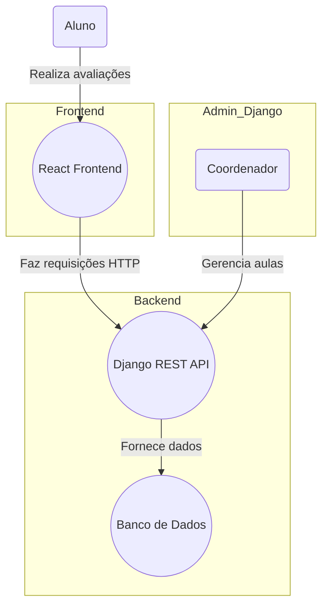

# Me Avalia

Projeto desenvolvido em Django que tem como objetivo permitir com que alunos de avaliem aulas das disciplinas ministradas no curso de computação.

Diagrama do Sistema




# Implementações

Autenticação baseadas em Token

Perfis e Níveis de Permissão

    Aluno: Avaliar aulas

    Coordenador: Atribuir disciplinas aos professores, Criar os usuários dos Estudantes, Adicionar os alunos nas turmas matriculadas, Manter as aulas de cada turma. 

# Instalação e Execução

Dependência: python = "^3.10"

Clonagem do repositório

```bash
git clone https://github.com/gustavo-patricio/me-avalia.git
```

Intalando dependências


**linux/mac**

```bash
cd me-avalia
python3 -m pip install -r requirements.txt
```

Execução

```bash
python3 manage.py runserver 
```

# Teste e Documentação da API

A documentação da API pode ser acessada no endpoint "/swagger" que contém a ferramenta Swagger como especificação, documentação e teste.


